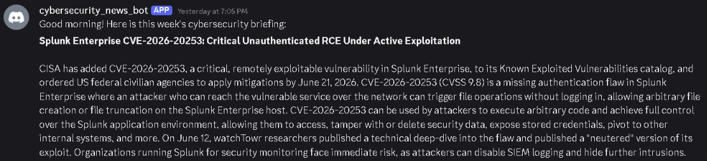
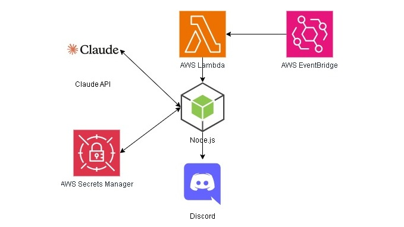

# security-news-discord-bot



Summarises cybersecurity news using AI and sends to Discord.

The architecture diagram above shows my workflow of sending the summarised articles every week. Feel free to modify the code if you are planning to use another service (e.g. ChatGPT, Telegram)



Services
- Claude API → AI to fetch news
- AWS Secrets Manager → Store Claude and Discord API keys
- AWS Lambda → Runs Node.js code
- AWS EventBridge → Schedule to run the Lambda function at every Sunday, 8am
- Discord → Receive summarised articles

## Knowledge base
Here are some difficulties I've faced while developing the application, and would like to put them here:

**Q: What are the billing costs?**

**A:** All AWS services are in the free tier that does not exceed the limits. As for Claude, running a *Haiku 4.5* model that *summarises 6 articles with 120 words each* costs about **0.30 USD**.

**Q: Why is a Discord Channel ID required if I want to send a DM to myself?**

**A:** You cannot send a message to yourself without obtaining the Discord Channel ID. To obtain the channel ID, get the bot to join a server and create a channel using `curl`.

```bash
# Creates channel, returns channel ID
curl -X POST https://discord.com/api/v10/users/@me/channels -H "Authorization: Bot <apikey>" -H "Content-Type: application/json" -d '{"recipient_id": "<userid>"}'

# Test send message
curl -X POST https://discord.com/api/v10/channels/<channelid>/messages -H "Authorization: Bot <apikey>" -H "Content-Type: application/json" -d '{"content": "Hello World"}'
```

**Q: Why do you need to remove the markdown code block and HTML tags after obtaining the response from the AI model?**

**A:** From what I've experienced, the response includes code blocks ` ```json ` and HTML tags `<cite index="39-7">` that makes the JSON invalid and adds irrelevant texts respectively. Even if you modify the prompt, it will still include them. **Therefore, code sanitization would be better as compared to prompt sanitization**.